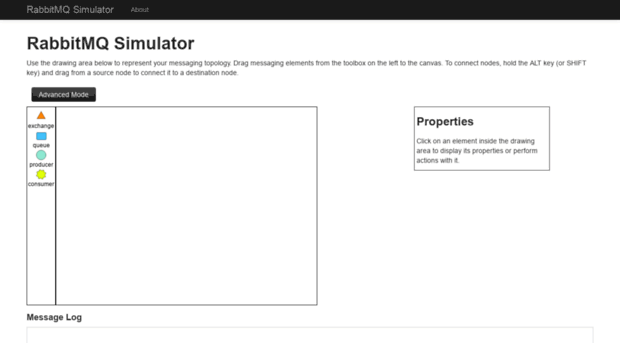

# RabbitMQ Simulator

Use the drawing area below to represent your messaging topology. Drag messaging elements from the toolbox on the left to the canvas. To connect nodes, hold the ALT key (or SHIFT key) and drag from a source node to connect it to a destination node.

http://tryrabbitmq.com

